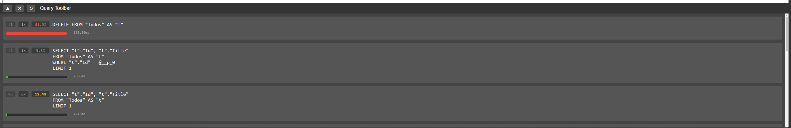

# EfCoreQueryToolbar


Intercepts SQL queries from Entity Framework Core and shows them in an HTML toolbar within your web app.



## Compatability

Any Entity Framework Core version that supports Interceptor should work.


## Installation

```
dotnet add package EfCoreQueryToolbar --version 0.0.1-alpha-gde64f9e45e --source https://www.myget.org/F/guneysu/api/v3/index.json 
```


```csharp
builder.Services.AddEfCoreProfilerToolbar();

...

app.UseEfCoreQueryToolbar();

```


## Contribution

Feel free to raise a ticket.


## Disclaimer

- **Do not use on Production.**